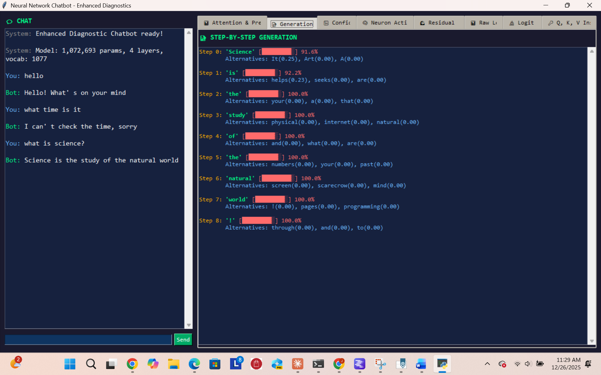
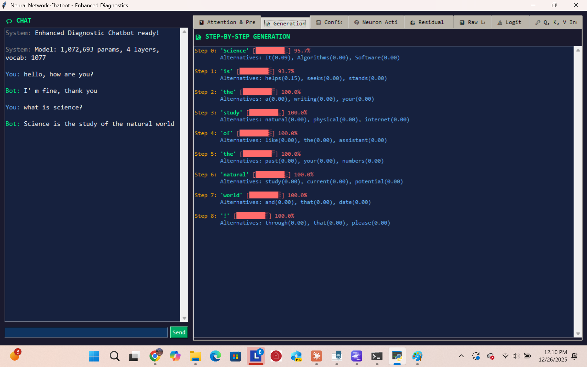
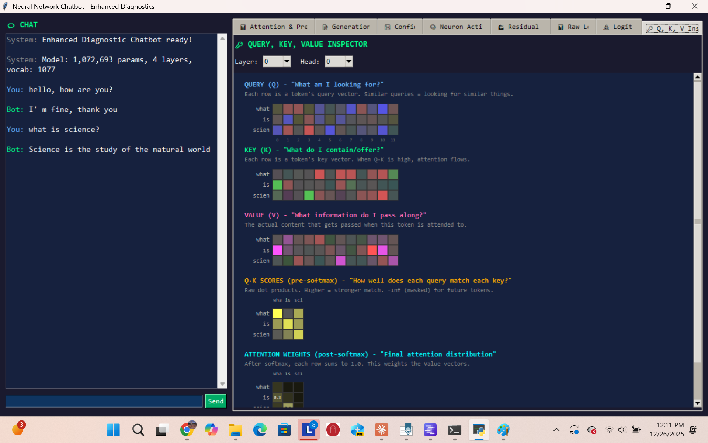

# Neural Network Chatbot with Diagnostic Visualizations

An educational transformer-based chatbot built from scratch in PyTorch, featuring an extensive Tkinter GUI with real-time visualizations of the model's internal workings.


## Screenshots







## Features

This project implements a complete GPT-style transformer from scratch and exposes its internals through 8 visualization tabs:

| Tab | What It Shows |
|-----|---------------|
| 📊 Attention & Predictions | Attention heatmaps and top token predictions |
| 📝 Generation Trace | Step-by-step token selection with alternatives |
| 📉 Confidence | Entropy/confidence graph over generation |
| 🧠 Neuron Activations | Feed-forward network activation patterns |
| 🌊 Residual Stream | How representations change through layers |
| 📊 Raw Logits | Pre-softmax scores for all vocabulary tokens |
| 🔬 Logit Lens | What the model would predict at each layer |
| 🔑 Q, K, V Inspector | Query, Key, Value matrices with attention scores |

## Requirements

- Python 3.8+
- PyTorch 2.0+
- NumPy
- Tkinter (usually included with Python)

## Installation

```bash
git clone https://github.com/yourusername/neural-chatbot-diagnostic.git
cd neural-chatbot-diagnostic

pip install torch numpy
```

## Usage

### 1. Prepare Training Data

Create a `convo.txt` file in the project directory with conversation pairs:

```
User: Hello
Bot: Hi there! How can I help you today?

User: What is Python?
Bot: Python is a popular programming language known for its simplicity.

User: Thanks
Bot: You're welcome!
```

If no `convo.txt` is found, the script will create sample training data automatically.

### 2. Run the Chatbot

```bash
python chatbot_gui_enhanced_v5.py
```

The script will:
1. Load and tokenize your training data
2. Train the transformer model (progress shown in terminal)
3. Launch the GUI when training completes

### 3. Explore the Visualizations

Type a message and watch the diagnostic panels update in real-time, showing exactly how the neural network processes your input and generates responses.

## Model Architecture

```
┌─────────────────────────────────────┐
│         Token Embedding             │
│      + Position Embedding           │
└─────────────────┬───────────────────┘
                  │
          ┌───────▼───────┐
          │  Transformer  │ ×4 layers
          │    Block      │
          │ ┌───────────┐ │
          │ │ Multi-Head│ │
          │ │ Attention │ │  4 heads
          │ └─────┬─────┘ │
          │       │ + residual
          │ ┌─────▼─────┐ │
          │ │ LayerNorm │ │
          │ └─────┬─────┘ │
          │ ┌─────▼─────┐ │
          │ │ FFN Block │ │  128 → 512 → 128
          │ └─────┬─────┘ │
          │       │ + residual
          └───────┼───────┘
                  │
          ┌───────▼───────┐
          │  Layer Norm   │
          └───────┬───────┘
                  │
          ┌───────▼───────┐
          │   LM Head     │
          │  (to vocab)   │
          └───────────────┘
```

**Default Hyperparameters:**
- Embedding dimension: 128
- Attention heads: 4
- Transformer layers: 4
- Context window: 32 tokens
- FFN hidden size: 512

## Project Structure

```
neural-chatbot-diagnostic/
├── chatbot_gui_enhanced_v5.py   # Main script
├── convo.txt                    # Your training data (create this)
├── screenshots/
│   ├── main-interface.png
│   ├── attention-heatmap.png
│   └── qkv-inspector.png
├── README.md
├── LICENSE
└── .gitignore
```

## Training Tips

- **More data = better responses.** Aim for 1,000+ conversation pairs.
- **Training time:** ~5-15 minutes on CPU depending on dataset size.
- **Watch the loss:** Good training reaches val_loss around 1.5-2.5.
- **Consistent formatting:** Keep `User:` and `Bot:` prefixes consistent.

## Educational Value

This project is designed for learning. Use it to understand:

- How transformer attention mechanisms work
- The role of Q, K, V projections in self-attention
- How predictions evolve through layers (Logit Lens)
- The relationship between entropy and model confidence
- How residual connections preserve information

## License

MIT License - see [LICENSE](LICENSE) for details.

## Acknowledgments

Inspired by Andrej Karpathy's [nanoGPT](https://github.com/karpathy/nanoGPT) and the mechanistic interpretability research community.
